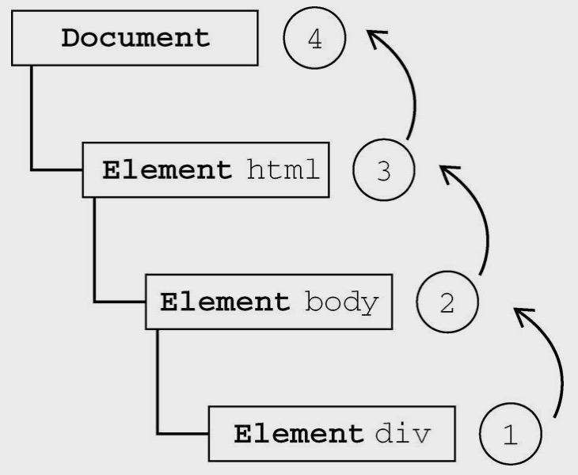

# 事件流

时间流描述的是从页面中接收事件的顺序。

### 事件冒泡

IE的事件流叫事件冒泡（event bubbling），即事件开始时由最具体的元素（文档中嵌套层次最深的那个节点）接收，然后逐级向上传播到较为不具体的节点（文档）。



所有现代浏览器都支持事件冒泡，会将事件一直冒泡到window对象。

### 事件捕获

事件捕获（event capturing）的思想是不太具体的界点应该更早接收到事件，而最具体的节点应该最后接收到事件。事件捕获的用意在于在事件到达预定目标之前捕获它。


### DOM事件流

“DOM2级事件”规定的事件流包括三个阶段：事件捕获阶段、处于目标阶段和事件冒泡阶段。

首先发生的是事件捕获，为截获事件提供了机会。然后是实际的目标接收到事件。最后一个阶段是冒泡阶段，可以在这个阶段对事件做出响应。


## 事件处理程序

事件就是用户或浏览器自身执行的某种动作。诸如click、load和mouseover，都是事件的名字。而响应某个事件的函数就叫做事件处理程序（或事件侦听器）。事件处理程序的名字以“on”开头，因此click事件的事件处理程序就是onclick，load事件的事件处理程序就是onload。

### DOM0级事件处理程序

通过JavaScript指定事件处理程序的传统方式，就是将一个函数赋值给一个事件处理程序属性。要使用JavaScript指定事件处理程序，首先必须取得一个要操作的对象的引用。

使用DOM0级方法指定的事件处理程序被认为是元素的方法。因此，这时候的事件处理程序是在元素的作用域中运行，程序中的this引用的是当前元素，可以在事件处理程序中通过this访问元素的任何属性和方法。以这种方式添加的事件处理程序会在事件流的冒泡阶段被处理。

也可以删除通过DOM0级方法指定的事件处理程序，只要将事件处理程序属性的值设置为null即可，之后将不会有任何动作发生。

### DOM2级事件处理程序

“DOM2级事件”定义了两个方法，用于处理指定和删除事件处理程序的操作：addEventListener()和removeEventListener()。所有DOM节点中都包含这两个方法，并且它们都接收三个参数：要处理的事件名、作为事件处理程序的函数和一个布尔值。最后这个布尔值的参数如果是true，表示在捕获阶段调用事件处理程序；如果是false，表示在冒泡阶段调用事件处理程序。

```javascript
element.addEventListener('click', function() {
  // body...
}, false);
```

通过addEventListener()添加的事件处理程序只能使用removeEventListener()来移除；移除时传入的参数与添加处理程序时使用的参数相同。这也意味着通过addEventListener()添加的匿名函数将无法移除。

```javascript
var handler = function() {
  // body...
};
element.addEventListener('click', handler, false);
element.removeEventListener('click', handler, false);
```

> 大多数情况下，都是将事件处理程序添加到事件流的冒泡阶段，这样可以最大限度地兼容各种浏览器。最好只在需要在事件到达目标之前截获它的时候将事件处理程序添加到捕获阶段。如果不是特别需要，不建议在事件捕获阶段注册事件处理程序。

### IE事件处理程序

IE实现了与DOM中类似的两个方法：attachEvent()和detachEvent()。这两个方法接收相同的两个参数：事件处理程序名称与事件处理程序函数。通过attachEvent()添加的事件处理程序都会被添加到冒泡阶段。

```javascript
var handler = function() {
  // body...
};
element.attachEvent('onclick', handler);
element.detachEvent('onclick', handler);
```

> 注意：第一个参数是“onclick”。在使用attachEvent()方法的情况下，事件处理程序会在全局作用域中运行，因此this等于window。

```javascript
element.attachEvent('onclick', function() {
  alert(this === window); // true
});
```

### 跨浏览器的事件处理程序

推荐使用jQuery。