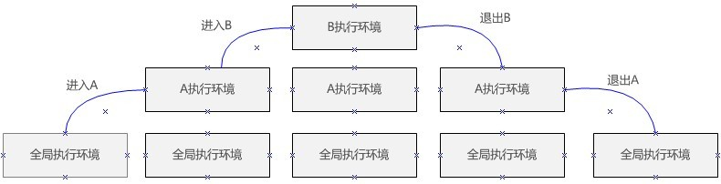

# 变量、作用域和内存问题

### 基本类型和引用类型的值

* 基本类型值指的是简单的数据段，引用类型值指那些可能由多个值构成的对象。
* 5种基本数据类型：Undefined、Null、Boolean、Number和String。按值访问，可以操作保存在变量中的实际的值。
* 引用类型的值是保存在内存中的对象。JavaScript不允许直接访问内存中的位置，不能直接操作对象的内存空间。在操作对象时，实际上是在操作对象的引用而不是实际的对象。引用类型的值是按引用访问的。

### 复制变量值

* 如果从一个变量向另一个变量复制基本类型的值，会在变量对象上创建一个新值，然后把该值复制到为新变量分配的位置上。此后，这两个变量可以参与任何操作而不相互影响。
* 当从一个变量向另一个变量复制引用类型的值时，同样也会将存储在变量对象中的值复制一份放到为新变量分配的空间中，不同的是，这个值的副本实际上是一个指针，而这个指针指向存储在堆中的一个对象。复制操作结束后，两个变量实际上将引用同一个对象。改变其中一个对象，就会影响另一个变量。

### 传递参数

ECMAScript中所有函数的参数都是按值传递的。把函数外部的值复制给函数内部的参数，就和把值从一个变量复制到另一个变量一样。基本类型值的传递如同基本类型变量的复制一样，引用类型值的传递如同引用类型变量的复制一样。

### 执行环境及作用域

* 执行环境的类型有两种：全局和局部（函数）。
* 执行环境定义了变量或函数有权访问的其它数据，决定了它们各自的行为。
* 每个执行环境都有一个与之关联的变量对象（variable object），环境中定义的所有变量和函数都保存在这个对象中。虽然我们编写的代码无法访问这个对象，但解析器在处理数据时会在后台使用它。
* 根据ECMAScript实现所在的宿主环境不同，表示执行环境的对象也不一样。在Web浏览器中，全局执行环境被认为是window对象，因此所有全局变量和函数都是作为window对象的属性和方法创建的。
* 某个执行环境中的所有代码执行完毕后，该环境被销毁，保存在其中的所有变量和函数定义也随之销毁（全局执行环境直到应用程序退出－如关闭网页或浏览器－时才会被销毁）。
* 内部环境可以通过作用域链访问所有的外部环境，但外部环境不能访问内部环境中的任何变量和函数。
* 函数参数也被当作变量来对待，因此其访问规则与执行环境中的其它变量相同。
* 使用var声明的变量会自动被添加到最接近的环境中。

### 小结

JavaScript变量可以用来保存两种类型的值：基本类型值和引用类型值。基本类型值和引用类型值具有以下特点：

* 基本类型的值在内存中占据固定大小的空间，因此被保存在栈内存中；
* 从一个变量向另一个变量复制基本类型的值，会创建这个值的一个副本；
* 引用类型的值是对象，保存在堆内存中；
* 包含引用类型值的变量实际上包含的并不是对象本身，而是一个指向该对象的指针；
* 从一个变量向另一个变量复制引用类型的值，复制的其实是指针，因此两个变量最终都指向同一个对象；
* 确定一个值是哪种基本类型可以用typeof操作符，而确定一个值是哪种引用类型可以使用instanceof操作符。

所有变量（包括基本类型和引用类型）都存在于一个执行环境（也称为作用域）当中，这个执行环境决定了变量的声明周期，以及哪一部分代码可以访问其中的变量。一下是关于执行环境的几点总结：

* 执行环境优全局执行环境和函数执行环境之分；
* 每次进入一个新执行环境，都会创建一个用于搜索变量和函数的作用域链；
* 函数的局部环境不仅有权访问函数作用域中的变量，而且有权访问其包含（父）环境，乃至全局环境；
* 全局环境只能访问在全局环境中定义的变量和函数，而不能直接访问局部环境中的任何数据；
* 变量的执行环境有助于确定应该何时释放内存。

JavaScript具有自动垃圾收集机制：

* 离开作用域的值将被自动标记为可回收，因此将在垃圾收集期间被删除。
* “标记清除”是目前主流的垃圾收集算法，这种算法的思想是给当前不适用的值加上标记，然后再回收其内存。
* 解除变量的引用不仅有助于消除循环引用现象，而且堆垃圾收集也有好处。为了确保有效地回收内存，应该及时解除不再使用的全局对象、全局对象属性以及循环引用变量的引用。